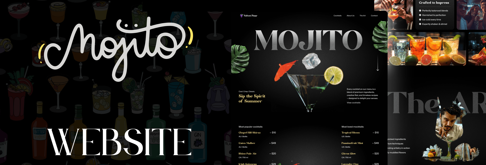

<div align="center">
  <br />
  
  <br />

  <div>
    
    
    
  </div>

  <h3 align="center">GSAP Cocktail Website – Developed by Salah</h3>

  <div align="center">
    A modern animated cocktail-themed website created using React, GSAP, and Tailwind CSS. Includes advanced scroll animations, parallax effects, and fully responsive design.
  </div>
</div>

---

## 📋 Table of Contents

1. [🤖 Introduction](#-introduction)
2. [⚙️ Tech Stack](#-tech-stack)
3. [🔋 Features](#-features)
4. [🚀 Getting Started](#-getting-started)
5. [🔗 Links](#-links)
6. [🚀 Contact](#-contact)
7. [📄 License](#license)

---

## 🤖 Introduction

This is a fully responsive and scroll-animated website designed for a cocktail theme. It’s built with modern technologies and is optimized for both desktop and mobile viewing. This project demonstrates how to create interactive animations using GSAP’s powerful tools integrated into a React app.

---

## ⚙️ Tech Stack

- **[GSAP](https://gsap.com/)** for scroll-driven animations  
- **[React](https://react.dev/)** for building UI components  
- **[Tailwind CSS](https://tailwindcss.com/)** for styling  
- **[Vite](https://vitejs.dev/)** for fast builds and hot reloading

---

## 🔋 Features

- 🎞️ Scroll-synced video playback  
- 🔠 SplitText animations  
- 🎢 Parallax and pinned sections  
- 🎠 Custom animated carousel  
- 🖼️ Image masking transitions  
- 💡 Fully responsive design  

---

## 🚀 Getting Started

### Prerequisites

- [Git](https://git-scm.com/)
- [Node.js](https://nodejs.org/en)
- [npm](https://www.npmjs.com/)

### Clone & Setup

```bash
git clone https://github.com/adrianhajdin/gsap_cocktails.git
cd gsap_cocktails
npm install
npm run dev
```

Visit [http://localhost:5173](http://localhost:5173) to view the project.

---

## 🔗 Links
The Figma design used in the project can be found [here](https://www.figma.com/proto/MByXaI8pcleIbgTvsDat1X/Cocktail-GSAP-Website?node-id=42001-1163&p=f&t=U1ebR7voWSUjnCee-1&scaling=min-zoom&content-scaling=fixed&page-id=2%3A2)

---

## 🚀 Contact

Feel free to reach out:

- Email: [email](mailto:error.salah59@gmail.com)
- VC:    [ Salah Cv ](https://salahcv.site/)

---

## License

This project is licensed under the **MIT License**.

---


